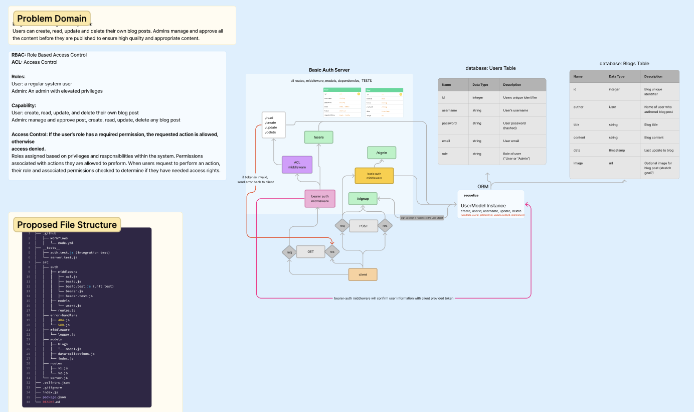

# Project: blog-central
A blogging platform that allows users to create, manage, and share their blog posts while ensuring content quality through admin moderation.

### AuthorS: Heather Holcomb, Coriana Wiiliams

### Problem Domain

Users can create, read, update and delete their own blog posts. Admins manage and approve all the content before they are published to ensure high quality and appropriate content.

### Links and Resources

- [GitHub Actions ci/cd](https://github.com/Coriana1/auth-api/actions)
- [back-end dev server url](https://auth-api-zqkj.onrender.com)

### Setup

#### `.env` requirements (where applicable)

port variable exists within the env sample

#### How to initialize/run your application (where applicable)

clone repo, `npm i`, then run `nodemon` in the terminal

#### Routes

- GET : `/success` - specific route to hit

#### Tests

to run tests, after running `npm i`, run the command `npm test`

#### UML

